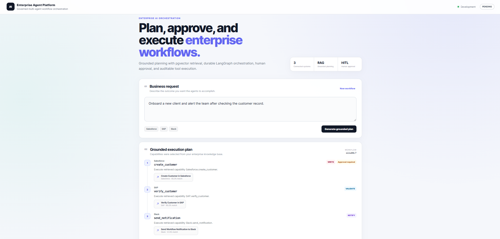
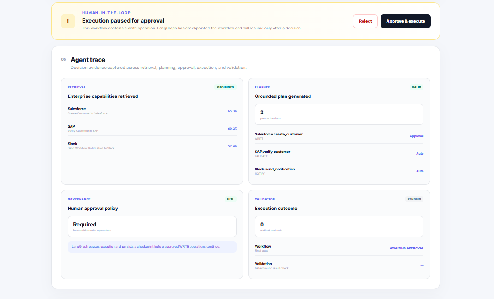
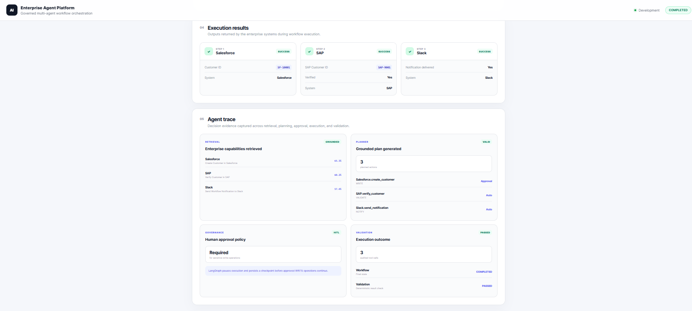

# Enterprise AI Agent Platform

A production-deployed, governed multi-agent workflow orchestration platform that converts natural-language business requests into grounded, auditable enterprise workflows.

The platform combines retrieval-augmented generation (RAG), PostgreSQL + pgvector, LangGraph orchestration, human-in-the-loop approval, deterministic tool execution, and execution validation.

## Live Application

Frontend:
https://intuitive-reflection-production-428c.up.railway.app/

Backend API:
https://enterprise-ai-agent-platform-production.up.railway.app/

Health:
https://enterprise-ai-agent-platform-production.up.railway.app/api/v1/live

## Demo

### Grounded Enterprise Workflow

The platform retrieves enterprise capabilities and generates a source-grounded execution plan across Salesforce, SAP, and Slack.



### Human-in-the-Loop Approval

Sensitive `WRITE` operations pause before execution and require explicit human approval.



### Auditable Execution

After approval, the workflow executes registered enterprise adapters and records the execution trace and validation outcome.



**Result:** `COMPLETED` · **Executed Steps:** `3` · **Validation:** `PASSED`

## What It Does

A user provides a business objective such as:

> Onboard a new client and alert the team after checking the customer record.

The platform:

1. Retrieves relevant enterprise capabilities using vector similarity search.
2. Builds a source-grounded execution plan.
3. Determines which operations require human approval.
4. Pauses execution before sensitive WRITE operations.
5. Executes approved enterprise tool adapters.
6. Records an auditable execution trace.
7. Validates the final workflow outcome.

Example workflow:

Business Request
→ RAG Retrieval
→ Salesforce
→ Human Approval
→ SAP Validation
→ Slack Notification
→ Validation
→ Completed

## Architecture

```text
┌───────────────────────────┐
│      React + Vite UI      │
└─────────────┬─────────────┘
              │ HTTPS
              ▼
┌───────────────────────────┐
│        FastAPI API        │
│                           │
│ Planner / Workflow /      │
│ Execution / Knowledge     │
└─────────────┬─────────────┘
              │
       ┌──────┴──────┐
       ▼             ▼
┌─────────────┐  ┌───────────────┐
│ RAG Layer   │  │   LangGraph   │
│ FastEmbed   │  │ Orchestration │
└──────┬──────┘  └───────┬───────┘
       │                 │
       ▼                 ▼
┌─────────────────────────────────┐
│ PostgreSQL + pgvector           │
│                                 │
│ Knowledge / Workflows /         │
│ Checkpoints / Execution Logs    │
└─────────────────────────────────┘
              │
              ▼
┌─────────────────────────────────┐
│ Enterprise Tool Adapters        │
│ Salesforce | SAP | Slack        │
└─────────────────────────────────┘

Core Capabilities
Grounded RAG Planning

Enterprise capability documentation is embedded and stored in PostgreSQL using pgvector.

At planning time, the platform embeds the business request and performs vector similarity retrieval to select relevant enterprise capabilities.

The planner therefore operates against retrieved capability metadata rather than selecting arbitrary tools.

Human-in-the-Loop Governance

Operations that modify enterprise data can be marked as requiring approval.

For example:

Salesforce.create_customer
Action type: WRITE
Approval: Required

LangGraph pauses workflow execution before the protected operation and resumes after approval.

Enterprise Tool Execution

The project demonstrates an extensible adapter architecture for enterprise systems including:

Salesforce — customer creation
SAP — customer verification
Slack — workflow notification

The current adapters provide deterministic demonstration behavior and can be replaced with authenticated production integrations.

Auditable Execution

Each workflow captures execution evidence including:

selected capabilities
execution plan
approval requirements
tool calls
tool inputs and outputs
execution status
execution timing
validation result
Example

Input:

Onboard a new client and alert the team after checking the customer record.

Retrieved capabilities:

Salesforce — Create Customer in Salesforce
SAP        — Verify Customer in SAP
Slack      — Send Workflow Notification to Slack

Grounded plan:

1. Salesforce.create_customer
   WRITE — Human approval required


2. SAP.verify_customer
   VALIDATE — Automatic


3. Slack.send_notification
   NOTIFY — Automatic

Result:

Workflow Status: COMPLETED
Executed Steps: 3
Validation: PASSED
Technology Stack
Layer	Technology
Frontend	React, TypeScript, Vite
Backend	FastAPI, Python
Orchestration	LangGraph
Database	PostgreSQL
Vector Search	pgvector
Embeddings	FastEmbed
ORM	SQLAlchemy
Deployment	Railway
Containers	Docker
Web Server	Nginx
Repository Structure
enterprise-ai-agent-platform/
├── backend/
│   ├── app/
│   │   ├── api/
│   │   ├── agents/
│   │   ├── core/
│   │   ├── models/
│   │   ├── rag/
│   │   ├── schemas/
│   │   ├── services/
│   │   └── tools/
│   ├── scripts/
│   ├── tests/
│   └── Dockerfile
│
├── frontend/
│   ├── src/
│   ├── Dockerfile
│   └── nginx.conf
│
├── docs/
├── docker-compose.yml
└── README.md
Local Development
Backend
cd backend


python -m venv .venv
source .venv/bin/activate


pip install -r requirements.txt

Configure the required environment variables and start the API:

uvicorn app.main:app --reload
Frontend
cd frontend
npm install
npm run dev
Knowledge Seeding

Seed the enterprise capability knowledge base:

cd backend
PYTHONPATH=. python scripts/seed_knowledge.py

The seeder is idempotent and skips capability documents that already exist.

Backfill missing embeddings when required:

PYTHONPATH=. python scripts/backfill_embeddings.py
Production Deployment

The application is deployed as separate Railway services:

React/Vite frontend
        │
        │ HTTPS
        ▼
FastAPI backend
        │
        ▼
Railway PostgreSQL + pgvector

Both frontend and backend are containerized independently.

Engineering Highlights

This project demonstrates:

retrieval-grounded agent planning
semantic enterprise capability discovery
durable workflow orchestration
human approval gates
deterministic tool execution
PostgreSQL vector retrieval
auditability and execution tracing
backend/frontend service separation
Dockerized production deployment
production CORS configuration
idempotent knowledge ingestion
Current Scope

Salesforce, SAP, and Slack are implemented as enterprise tool adapters for demonstrating orchestration behavior. They do not currently perform authenticated writes against live Salesforce, SAP, or Slack accounts.

The architecture is designed so those adapters can be replaced with real API integrations without changing the planner and orchestration model.

Future Improvements
OAuth-backed Salesforce integration
SAP API integration
Slack API integration
authentication and RBAC
tenant-specific knowledge bases
streaming agent events
expanded approval policies
observability and distributed tracing
automated evaluation of retrieval quality
CI/CD integration tests
License

This project is intended as an engineering and portfolio demonstration.


Because the actual URLs need to be navigable in the final README, keep them as normal Markdown/raw links **inside GitHub**, even though I don't render raw URLs directly in chat.


One thing I deliberately changed in the positioning: **don't claim the project currently integrates with real Salesforce/SAP/Slack accounts**. Your successful workflow proves the orchestration/adapters work, but we should describe them as deterministic enterprise adapters until we've actually connected authenticated APIs.


After replacing the README, run:


```powershell
git diff -- README.m