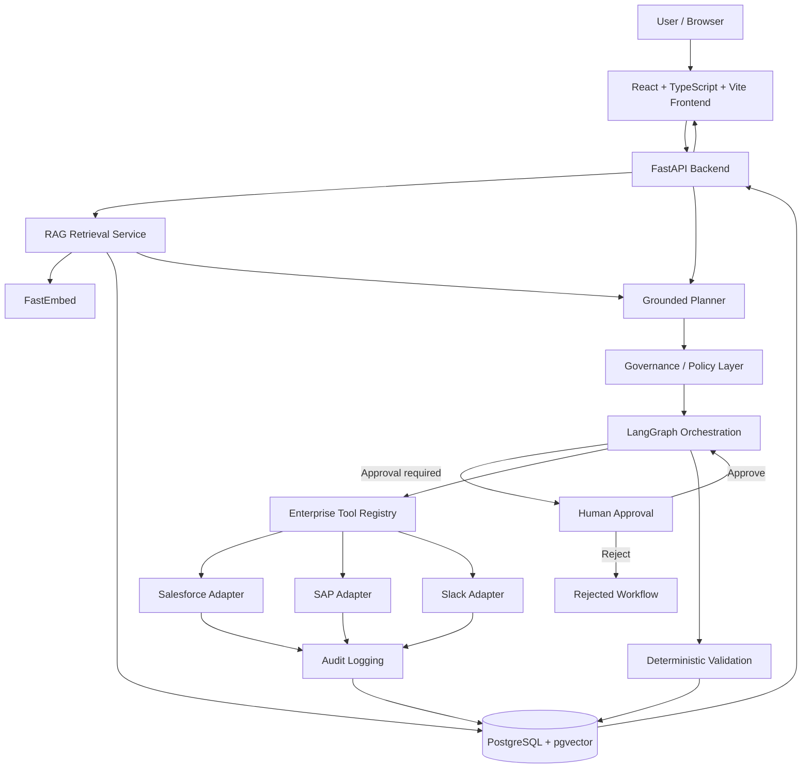
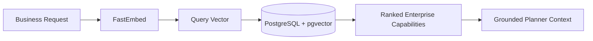
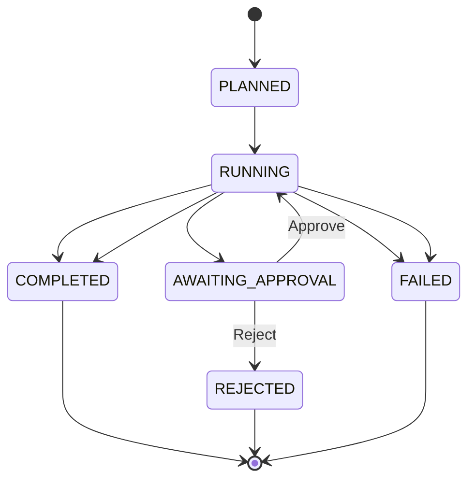
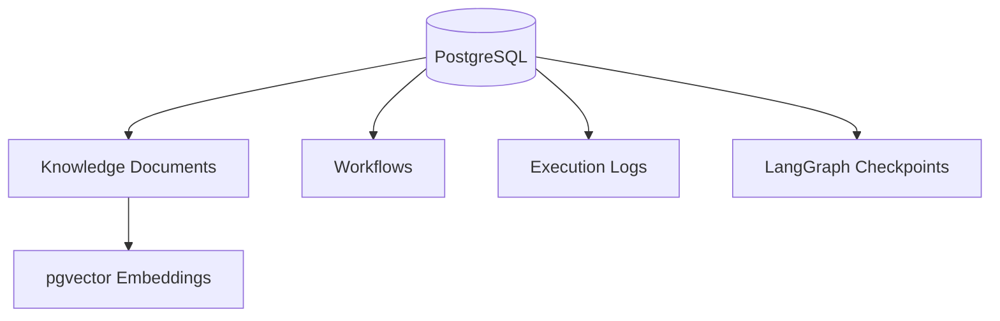
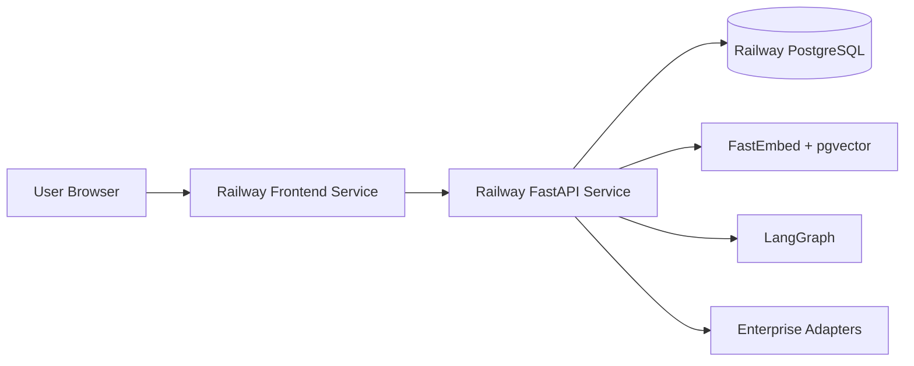

# Enterprise AI Agent Platform — Architecture

## Overview

The Enterprise AI Agent Platform is a governed workflow orchestration system that converts natural-language business requests into grounded, auditable enterprise workflows.

The architecture separates:

- semantic understanding
- retrieval
- planning
- governance
- workflow orchestration
- enterprise tool execution
- validation
- auditability

The key design principle is:

> AI proposes actions. Deterministic application logic governs and executes them.

---

## High-Level Architecture



## End-to-End Workflow

 ```mermaid
sequenceDiagram
    participant User
    participant UI as React UI
    participant API as FastAPI
    participant RAG as RAG / pgvector
    participant Planner
    participant Graph as LangGraph
    participant Human as Human Approval
    participant Tools as Enterprise Tools
    participant DB as PostgreSQL

    User->>UI: Enter business request
    UI->>API: POST /api/v1/planner

    API->>RAG: Embed and retrieve capabilities
    RAG->>DB: pgvector similarity search
    DB-->>RAG: Ranked capabilities
    RAG-->>Planner: Grounded capability context

    Planner-->>API: Structured execution plan
    API->>DB: Persist workflow
    API-->>UI: Workflow and grounded plan

    User->>UI: Run workflow
    UI->>API: POST /workflows/{id}/run

    API->>Graph: Start workflow
    Graph->>Human: Approval interrupt for WRITE action
    Human-->>Graph: Approve

    Graph->>Tools: Execute approved adapters
    Tools-->>Graph: Structured results

    Graph->>DB: Persist audit logs
    Graph->>Graph: Validate execution
    Graph->>DB: Persist final state

    API-->>UI: COMPLETED and results
```
## Frontend

### Technology

- React
- TypeScript
- Vite
- Nginx for production static serving

### Responsibilities

The frontend acts as the enterprise orchestration console.

It provides:

- business request input
- grounded execution plan display
- approval state
- execution timeline
- tool results
- retrieved capability evidence
- agent trace
- validation status

The frontend does not determine workflow state itself.

It reflects backend state returned by the API.

### Production Deployment

The frontend is deployed separately from the backend and communicates with the FastAPI service over HTTPS.

Production frontend:

https://intuitive-reflection-production-428c.up.railway.app/
## Backend API

### Technology

- Python
- FastAPI
- Pydantic
- SQLAlchemy
- Psycopg

### Responsibilities

The backend owns:

- request validation
- planning
- workflow persistence
- retrieval
- orchestration
- approval handling
- tool execution
- audit logging
- validation
- workflow state transitions

### Main API Surface

```text
POST /api/v1/planner

GET  /api/v1/workflows/{workflow_id}
GET  /api/v1/workflows/{workflow_id}/logs

POST /api/v1/workflows/{workflow_id}/run
POST /api/v1/workflows/{workflow_id}/approve
POST /api/v1/workflows/{workflow_id}/reject

POST /api/v1/execute/{workflow_id}

GET  /api/v1/knowledge/{document_id}
GET  /api/v1/live
```

## Retrieval-Augmented Generation

The planner does not select arbitrary enterprise tools.

Before planning, the backend performs semantic retrieval against the enterprise capability knowledge base.

### Retrieval Pipeline


### Embeddings

The platform uses FastEmbed with a local embedding model.

The capability documents contain information including:

- enterprise system
- tool name
- action
- action type
- approval requirement
- description
- metadata
- embedding vector

### Example Retrieved Capabilities

```text
Salesforce
Create Customer in Salesforce
salesforce.create_customer

SAP
Verify Customer in SAP
sap.verify_customer

Slack
Send Workflow Notification to Slack
slack.send_notification
```

## Grounded Planner

The planner converts:

```text
Business Request
+
Retrieved Enterprise Capabilities
```

into a structured execution plan.

The planner output is validated through typed application models rather than directly executing unstructured model text.

Example:

```text
Step 1
System: Salesforce
Tool: salesforce.create_customer
Action Type: WRITE
Approval Required: Yes

Step 2
System: SAP
Tool: sap.verify_customer
Action Type: VALIDATE
Approval Required: No

Step 3
System: Slack
Tool: slack.send_notification
Action Type: NOTIFY
Approval Required: No
```

The planner and executor are intentionally separate.

The planner proposes the workflow.

The executor only allows registered enterprise tools to run.

## Governance

Governance prevents generated plans from automatically executing sensitive operations.

Current policy model:

```text
WRITE    → Human approval required
VALIDATE → Automatic
NOTIFY   → Automatic
```

The system can be extended with additional policies later, such as:

- user roles
- financial thresholds
- environment restrictions
- tenant policies
- sensitive data rules
- dual approval
- time-based restrictions

## LangGraph Orchestration

LangGraph manages durable workflow execution.

Responsibilities include:

- workflow state
- ordered execution
- conditional routing
- approval interrupts
- resume behavior
- rejection behavior
- completion
- failure handling

### Workflow State Model



Sensitive operations pause before execution.

Approval resumes the workflow.

Rejection prevents protected tools from running.

## Human-in-the-Loop Approval

Human approval is a backend execution control, not a frontend animation.

For example:

```text
salesforce.create_customer
Action Type: WRITE
Policy: Approval Required
```

When the workflow reaches the protected action:

1. execution pauses
2. workflow state is persisted
3. the UI shows an approval requirement
4. the user approves or rejects
5. the backend resumes or terminates the workflow

This is one of the main governance features of the platform.

## Enterprise Tool Registry

The execution layer uses an explicit tool registry.

Current adapters:

```text
salesforce.create_customer
sap.verify_customer
slack.send_notification
```

The planner cannot generate an arbitrary function name and cause Python to execute it.

Only registered tools are executable.

This provides an important safety boundary between AI planning and application execution.

## Enterprise Adapters

### Salesforce

```text
Tool: salesforce.create_customer
Type: WRITE
Approval: Required
```

Example result:

```json
{
  "status": "success",
  "system": "Salesforce",
  "customer_id": "SF-10001"
}
```

### SAP

```text
Tool: sap.verify_customer
Type: VALIDATE
Approval: Automatic
```

Example result:

```json
{
  "status": "success",
  "system": "SAP",
  "verified": true,
  "sap_customer_id": "SAP-9001"
}
```

### Slack

```text
Tool: slack.send_notification
Type: NOTIFY
Approval: Automatic
```

Example result:

```json
{
  "status": "success",
  "system": "Slack",
  "delivered": true
}
```

These adapters currently provide deterministic demonstration behavior.

They are intentionally isolated so real authenticated integrations can replace them later.

## Persistence

PostgreSQL is the system of record.

It stores application state including:

- enterprise knowledge documents
- embeddings
- workflows
- workflow state
- execution logs
- tool results
- validation results
- orchestration checkpoints
pgvector provides semantic similarity search for the capability knowledge base.

## Audit Logging

Each workflow produces auditable execution evidence.

Examples include:

- workflow creation
- retrieval results
- selected capability
- generated plan
- approval requirement
- approval decision
- tool execution
- tool result
- execution timing
- validation outcome
- final workflow state
This makes the platform explainable at an operational level without exposing private model chain-of-thought.

## Validation

Execution success is not determined solely by an LLM.

The platform performs deterministic validation over structured tool results.

Example final state:

```text
Workflow Status: COMPLETED
Executed Steps: 3
Validation: PASSED
```

This improves reliability and makes the workflow outcome auditable.

## Database Architecture


## Deployment Architecture


### Deployment Services

The deployed project consists of:

- **Frontend:** React + Vite + Nginx
- **Backend:** FastAPI + Python
- **Database:** PostgreSQL + pgvector

Docker isolates each application service.

## Security Boundaries

The platform uses several architectural controls:

### Explicit Tool Allowlist

Only tools registered in the enterprise tool registry can execute.

### Human Approval

Sensitive WRITE actions pause before execution.

### Structured Planning

Planner output is validated before it becomes workflow state.

### Deterministic Validation

The LLM is not responsible for deciding whether tool execution succeeded.

### Environment-Based Secrets

Credentials and database configuration are supplied through environment variables rather than committed source code.

### Auditability

Tool execution and workflow state changes are persisted.

## Design Decisions

### PostgreSQL + pgvector Instead of an External Vector Database

Using PostgreSQL as both the application database and vector store keeps the architecture compact while preserving real semantic vector retrieval.

### Local FastEmbed Embeddings

FastEmbed allows semantic retrieval without requiring a separate paid embedding API.

### LangGraph for Durable Orchestration

LangGraph provides workflow state and interruption/resume semantics appropriate for human approval workflows.

### Separate Planning and Execution

The AI planner determines what capabilities are relevant.

Deterministic application logic controls what can actually run.

This prevents arbitrary model-generated tool execution.

### Simulated Enterprise Systems

Salesforce, SAP, and Slack are represented through deterministic adapters so the complete orchestration architecture can be demonstrated without exposing real enterprise credentials.

The adapter boundary preserves a clear path to real authenticated integrations later.

## Current Production Demo

Example request:

```text
Onboard a new client and alert the team after checking the customer record.
```

Expected grounded plan:

```text
1. Salesforce.create_customer
   WRITE
   Approval required

2. SAP.verify_customer
   VALIDATE

3. Slack.send_notification
   NOTIFY
```

Execution result:

```text
Workflow Status: COMPLETED
Executed Steps: 3
Validation: PASSED
```

## Future Architecture Extensions

Potential next-stage improvements include:

- OAuth-backed enterprise connectors
- authentication
- RBAC
- tenant isolation
- policy-as-code
- streaming workflow events
- WebSocket/SSE execution updates
- distributed tracing
- retrieval evaluation
- workflow retry policies
- production secrets management
- connector credential vaulting
- CI/CD integration tests
- multi-user approval workflows
